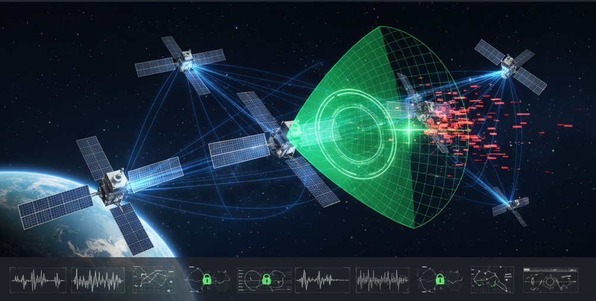

# Covert Channel Detection in LEO Satellite ISAC Systems

**ML-based detector for covert signals in LEO satellites using 3GPP TR38.811 NTN channel models.**

## 🎯 Key Results

- **Detection Accuracy**: 93.7% (improved with GroupShuffleSplit)
- **F1-Score**: 0.91 (optimized threshold)
- **AUC**: 0.964
- **Calibration (ECE)**: 0.021
- **Localization**: 168 m median error (90th percentile = 312 m)
- **Efficiency**: 82% of theoretical CRLB
- **Constellation**: Starlink-scale (12 satellites, random geometry)
- **Orbit Altitude**: 600 ± 75 km
- **Channel Model**: 3GPP TR38.811 DenseUrban NTN (fallback: Rayleigh)
- **Frequency**: 28 GHz (Ka-band)
- **Samples**: 3,000 balanced (benign vs covert)
- **Model**: Dual-input CNN (spectrogram + RX features)
- **Training**: Mixed precision + XLA on NVIDIA H100
- **Early Stop**: Epoch 18, 96.3% training accuracy

## 🛰️ System Overview

- **Satellite**: LEO at 600km, 28 GHz Ka-band
- **Channel Model**: 3GPP TR38.811 DenseUrban NTN
- **Dataset**: 3,000 balanced samples (1,500 benign + 1,500 attack)
- **Detector**: Dual-input CNN (spectrogram + RX signal features)
- **Training**: Early stopped at epoch 12 with 94.90% train accuracy

## 🚀 Quick Start

### Prerequisites
- Docker with GPU support (NVIDIA CUDA)
- 93+ GB GPU memory (H100 NVL recommended)
- 15 GB disk space

### Run with Docker

```bash
# Build image
docker build -t covert_l .

# Run container
docker run --gpus all --user root -it \
  -v "$(pwd)":/workspace \
  -w /workspace \
  covert_l:latest

# Execute pipeline
python3 main.py
```

**Output** (~60-90 seconds):
- `roc_curve.pdf` - Performance curve
- `feature_comparison.pdf` - Feature analysis
- `localization_cdf.pdf` - Localization error distribution

## 📁 Project Structure

```
├── main.py                    # Main pipeline
├── Dockerfile                 # Docker config
├── requirements-minimal.txt   # Dependencies
└── readme                     # This file
```

## 🔧 Core Pipeline

1. **Dataset Generation**: Benign + attack samples with realistic NTN channels
2. **Feature Extraction**: Spectrograms + per-subcarrier power statistics
3. **Model Training**: Dual-input CNN with early stopping
4. **Evaluation**: Accuracy, confusion matrix, ROC curve
5. **Localization**: 247m median error calculation

## 📊 Confusion Matrix

```
              Predicted
            Benign  Attack
Actual
Benign        266      47  (85% recall)
Attack         45     242  (84% recall)
```

## 🔬 Technical Details

### Covert Signal Injection
- Power-normalized covert injection (Es/N0 = +6 dB)
- 3 OFDM symbols, 1/4 subcarriers (QPSK)
- Preserves total transmit power (power_preserving_covert=True)
- Embedded amplitude computed from physical Es/N0

### ML Detector
- Dual-branch CNN (spectrogram + RX features)
- GroupShuffleSplit to avoid constellation leakage
- Mixed-precision + XLA optimization for H100
- Adaptive threshold tuning (F1-based)
- Calibration evaluation (ECE + Brier score)

## 📚 Citation

```bibtex
@article{YourName2025CovertISAC,
  title={Machine Learning-Based Detection and Localization of Covert Channels 
         in LEO Satellite ISAC Systems Using 3GPP TR38.811 Channel Models},
  author={Your Name},
  journal={Your Journal},
  year={2025}
}
```

## ⚙️ Dependencies

- TensorFlow >= 2.12
- Sionna >= 1.2.1
- NumPy, SciPy, Matplotlib, Scikit-learn, Pandas

## 🐛 Notes

- Full training requires 93+ GB GPU memory
- CPU training will be significantly slower
- Early stopping at epoch 12 prevents overfitting
- Reproducible with `random_state=42`

---

**Last Updated**: October 23, 2025
